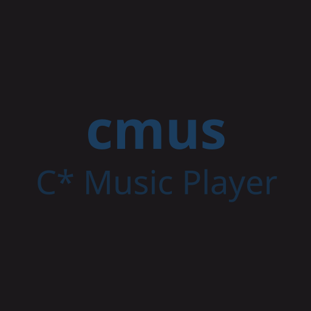

<div id="top"></div>

<!-- PROJECT LOGO -->
<br />
<div align="center">
  <a href="https://github.com/Senpai-10/cmus-rpc">
    
  </a>

  <h3 align="center">cmus-rpc</h3>

  <p align="center">
    Discord Rich Presence integration for the C* Music Player in rust
    <br />
    <br />
    <a href="https://github.com/Senpai-10/cmus-rpc/issues">Report Bug</a>
    ·
    <a href="https://github.com/Senpai-10/cmus-rpc/issues">Request Feature</a>
  </p>
</div>

<!-- TABLE OF CONTENTS -->
<details>
  <summary>Table of Contents</summary>
  <ol>
    <li>
      <a href="#getting-started">Getting Started</a>
      <ul>
        <li><a href="#prerequisites">Prerequisites</a></li>
        <li>
          <a href="#installation">Installation</a>
            <ul>
              <li><a href="#download-from-releases">Download from releases</a></li>
              <li>
                <a href="#build-from-source">Build from source</a>
                <ul>
                  <li><a href="#1-git-clone">1. git clone</a></li>
                  <li><a href="#1-2-cd-the-cloned-repository">1.2 cd the cloned repository</a></li>
                  <li><a href="#2-install">2. install</a></li>
                  <li><a href="#uninstall">uninstall</a></li>
                </ul>
              </li>
            </ul>
        </li>
      </ul>
    </li>
    <li><a href="#usage">Usage</a></li>
    <li><a href="#license">License</a></li>
    <li><a href="#contact">Contact</a></li>
    <li><a href="#inspired-by">Inspired by</a></li>
  </ol>
</details>

<!-- GETTING STARTED -->

### **Prerequisites**

-   build from source: [rust](https://www.rust-lang.org/tools/install)

### **Installation**

-   [download from releases](#download-from-releases)
-   [build from source](#build-from-source)

#### **Download from releases**

[Download For Linux](https://github.com/Senpai-10/cmus-rpc/releases/latest/download/cmus-rpc)

#### **Build from source**

```bash
cargo install --git https://github.com/Senpai-10/cmus-rpc
```

<p align="right">(<a href="#top">back to top</a>)</p>

<!-- USAGE EXAMPLES -->

## **Usage**

```bash
cmus-rpc --help
```

if you don't want notifications when playing or pausing songs

```bash
cmus-rpc --no-notifications
```

<p align="right">(<a href="#top">back to top</a>)</p>

<!-- LICENSE -->

## **License**

See [LICENSE](LICENSE).

<p align="right">(<a href="#top">back to top</a>)</p>

<!-- CONTACT -->

## **Contact**

Abdalrzag eisa [@senpai400](https://twitter.com/senpai400) - bmjfdrh@gmail.com

<p align="right">(<a href="#top">back to top</a>)</p>

<!-- inspired by -->

## **Inspired by**

-   [cmusrp-rust](https://github.com/pascalpuffke/cmusrp-rust)

<p align="right">(<a href="#top">back to top</a>)</p>
